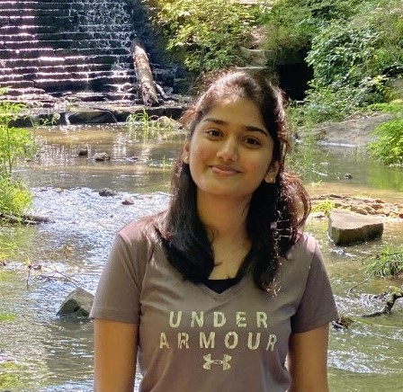
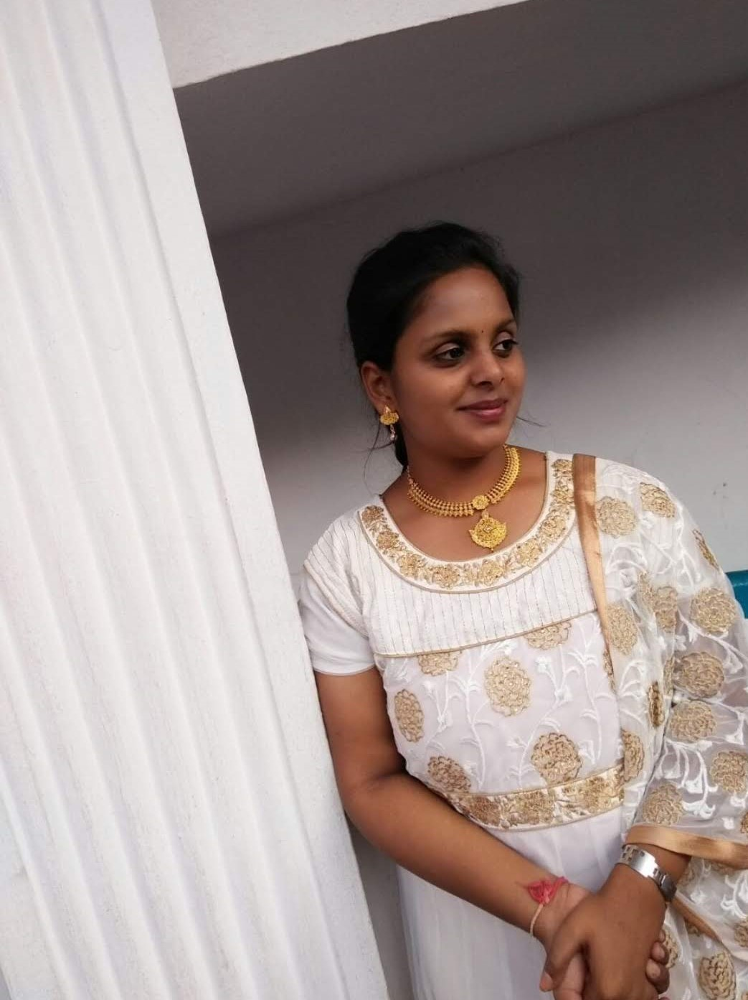
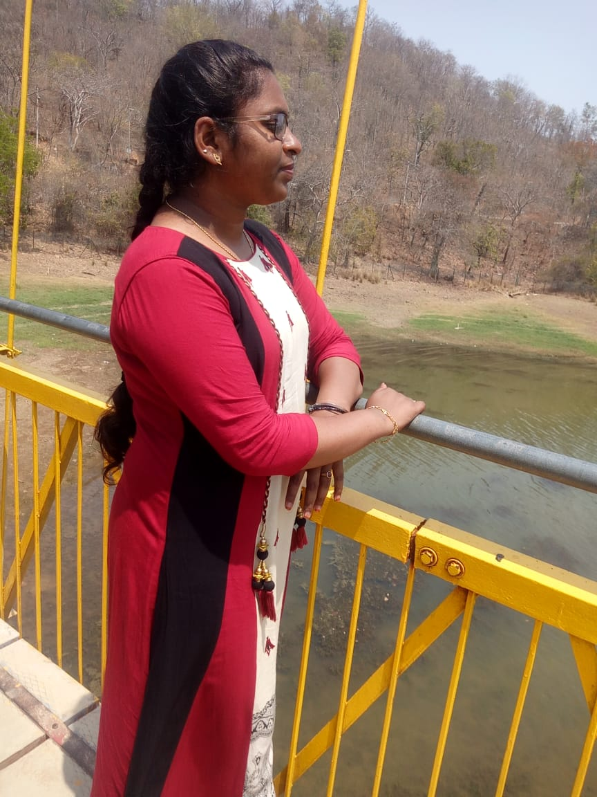
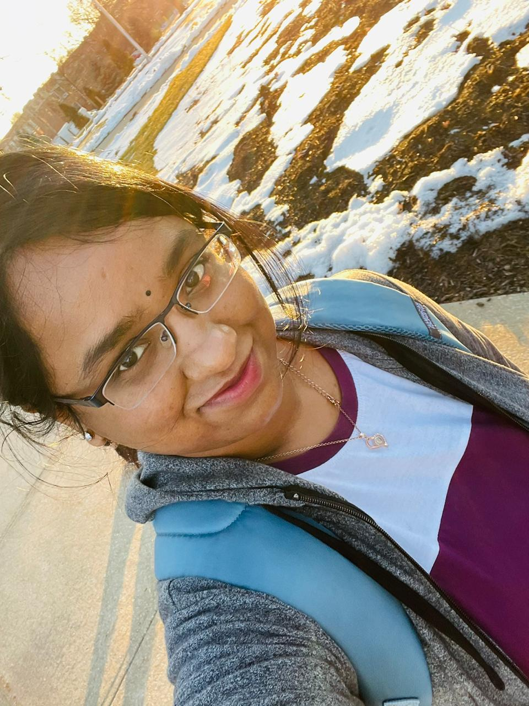
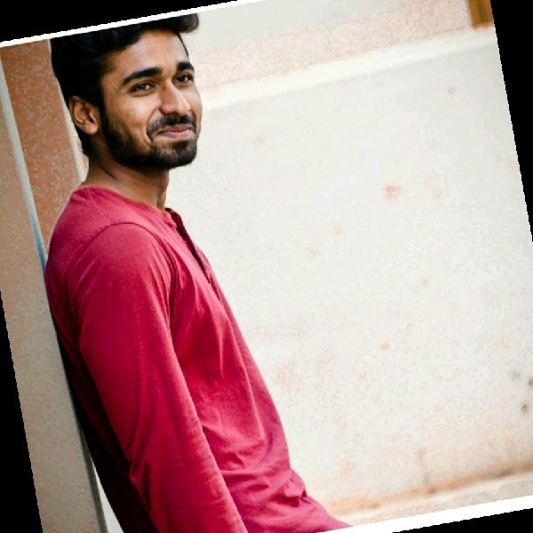

# 44-618-D01-AM3

## Part 1

Section 04

Group AM3

## Part 2 - The Members
Introduce each group member by providing their:

## Preferred name (what should we call you in class)? 
srisathyamamidala-  I would like to be called as sathya

Anusha Kanagala-  I would like to be called as Anusha 

Priyanka Maruthi- I would like to be called as Priyanka

Nithya Karepe- I would like to be called as Nithya

Harshavardhan Kurra- I would like to be called as Harsha

## Current degree
 srisathyamamidala-I am in second semester of masters in applied computer science 
 
  Anusha Kanagala- I'm pursuing my masters second semester in applied computer sciences
  
  Priyanka Maruthi - I'm pursuing my masters second semester in applied computer sciences
  
  Nithya Karepe-  I'm pursuing Masters in Applied Computer Science
  
  Harshavardhan Kurra- I'm pursuing Master's in Applied Computer Science
 

##  Past experience
srisathyamamidala- No past experience. I have completed my undergraduate in 2020

Anusha kanagala-  I don't have any past experiences

Priyanka Maruthi-4.2 Months as the AWS Devops engineer,Worked on Redshift,Mysql,SQL,PLSQLy,Jira.

Nithya Karepe- I have an experience as an intern at OpsRamp Hyderabad India.Worked on Java, MySQL.

Harshavardhan Kurra- I worked as python developer for 3 years.

## Future plans (what kind of work? what role? where?)
srisathyamamidala-My future plan is to become a java developer

Anusha Kanagala- I would like to work as a full stack developer in leading companies.

Priyanka Maruthi-I would like to Work as a full stack developer in Amazon.

Nithya Karepe- I want to work in an IT industry as a Full-Stack Developer.

Harshavardhan Kurra- In future, i would like to be a Full stack developer.

## LinkedIn profile:
[Nithya Karepe](https://www.linkedin.com/in/nithyakarepe/) 
[sathya mamidala](https://www.linkedin.com/in/sathya-mamidala-363b6a201/) 
[Anusha Kanagala](https://www.linkedin.com/in/anusha-kanagala-894466188/) 
[harsha kurra](https://www.linkedin.com/in/harsha-kurra-b25b3b177/)

## GitHub profile:
 [Nithya Karepe](https://github.com/KarepeN) 
 [srisathyamamidala](https://github.com/Maruthi158/44-618-D01-AM3) 
 [Anusha Kanagala](https://github.com/Anushakanagala) 
 [Priyanka](https://github.com/Maruthi158) 
 [harshakurra123](https://github.com/harshakurra123)

## Photo
                  )
 )
